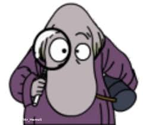

## <kasper luhtio> Web-tehtävä
# heading
## heading
### heading
#### heading
##### heading
###### heading

text is **bold**

text is _italic_

text is ___italic and bold___

text is ~~crossed off~~

[visit github](www.github.com)

> Hemuli
>> hemuli
>>> hemuli  
* item 1
* item 2
1. item 1
2. item 2
3. item 3

Do I contradict myself?  
Very well then I contradict myself,  
(I am large, I contain multitudes.)